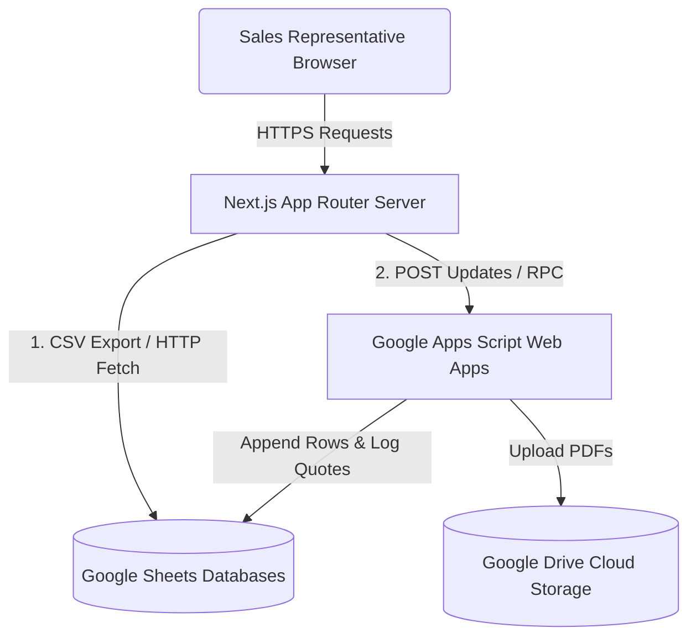

# MAAT Veterinary Trading - Sales Portal Architecture

This document describes the high-level architecture, design decisions, data flow, and directory structure of the **MAAT Sales Portal**.

---

## 1. High-Level Architecture

The portal is a lightweight, real-time B2B application designed for veterinary sales representatives in the United Arab Emirates (UAE). Instead of using a heavy relational database, it synchronizes dynamically with central Google Sheets databases representing inventory catalogs and clinic directories.



---

## 2. Directory Structure

The project follows a standard Next.js App Router structure:

```text
├── app/
│   ├── (dashboard)/            # Route group sharing navigation sidebar & header
│   │   ├── dashboard/          # Metrics, activity trends, and recent quotes table
│   │   ├── products/           # Live inventory catalog view with availability checks
│   │   ├── quotes/             # Quotations list, previews, downloads, and WhatsApp shares
│   │   │   └── new/            # Searchable Quote builder & new client registration modal
│   │   ├── settings/           # Profile settings and admin database sync logs
│   │   └── layout.tsx          # Shared layout grid wrapper with sidebar and header navbar
│   ├── api/                    # Server-side API endpoints
│   │   ├── customers/          # GET (list clinics) & POST (write via Apps Script)
│   │   ├── products/           # GET (list inventory products)
│   │   └── quotes/             # GET (list quotations logs) & POST (save quote PDF & sheet log)
│   ├── layout.tsx              # Root HTML element and context providers bootstrap
│   ├── login/                  # LTR/RTL login page with language switcher
│   └── page.tsx                # Session guard entry pointing to dashboard
├── components/                 # Reusable React components (DataTable, PageHeader, search inputs)
├── context/                    # React Context providers (AuthContext, LanguageContext)
├── hooks/                      # Custom hooks (useAuth)
├── lib/                        # Common utilities (jsPDF builder, timezone config, mock fallback data)
├── services/                   # Server-side data fetchers and caching interfaces
└── public/                     # Static assets (logos, profile images)
```

---

## 3. Data Synchronization & Cache Flow

To prevent database locks and latency overhead, the system leverages server-side memory caching for database read operations:

### Read Operations (Products & Customers)
1. Next.js server-side functions route queries to the Google Sheet CSV export endpoints.
2. The server parses the raw CSV stream into typed JavaScript objects.
3. **Caching Layer**: Results are cached in the server's memory heap with a **2-minute Time-To-Live (TTL)**. Subsequent user requests are resolved in **<10 milliseconds**.

### Write Operations (Adding Customers)
1. When a salesman adds a new customer in the UI, a request is sent to `/api/customers`.
2. The server relays the parameters to the Google Apps Script Web App endpoint.
3. The Apps Script appends a row to the central Clinic Directory Sheet.
4. **Cache Invalidation**: On successful response, `clearCustomersCache()` is invoked. This forces the server to bypass memory cache on the next load, guaranteeing the new customer is instantly visible to all salesmen.

### Quotation Save & PDF Generation
1. When a quotation is submitted:
   * A premium vector PDF is compiled on the client using **jsPDF** (`lib/pdfHelper.ts`).
   * The PDF is uploaded as a Base64 stream to `/api/quotes`, along with the quote metadata.
2. Next.js forwards this payload to the Google Apps Script Quotes Web App.
3. **Overwrite Logic**: The Apps Script checks for existing PDFs with the same quote number and moves them to trash before saving the new version to Google Drive.
4. The Apps Script logs/updates the quotation details (including raw item JSON payloads) in the central Quotes Sheet.

---

## 4. Role-Based Access Control (RBAC)

The application enforces data segmentation between roles:
* **Admin**:
  * Authorized to view total aggregated business metrics.
  * Sees settings compilation stats and developer sync panels.
  * Can search, download, and review all quotations compiled by all sales agents.
* **Salesman**:
  * Access is strictly segmented.
  * Dashboard cards and listings tables only show quotes matching their logged-in username (`user.name`).
  * Admin settings panels and system synchronization logs are hidden from settings.

---

## 5. Key Tech Stack & Libraries

* **Framework**: Next.js 16 (Turbopack, App Router).
* **Styling**: Vanilla Tailwind CSS.
* **PDF Compilation**: `jspdf` (for premium vector rendering, multi-page wraps, and customized VAT tables).
* **Localization**: Custom Context provider supporting English and Arabic, automatic layout flips (`dir="rtl"`), and translation dictionaries.
* **Timezone Manager**: Abu Dhabi Time (`Asia/Dubai` - UTC+4) is enforced on all saved records.
